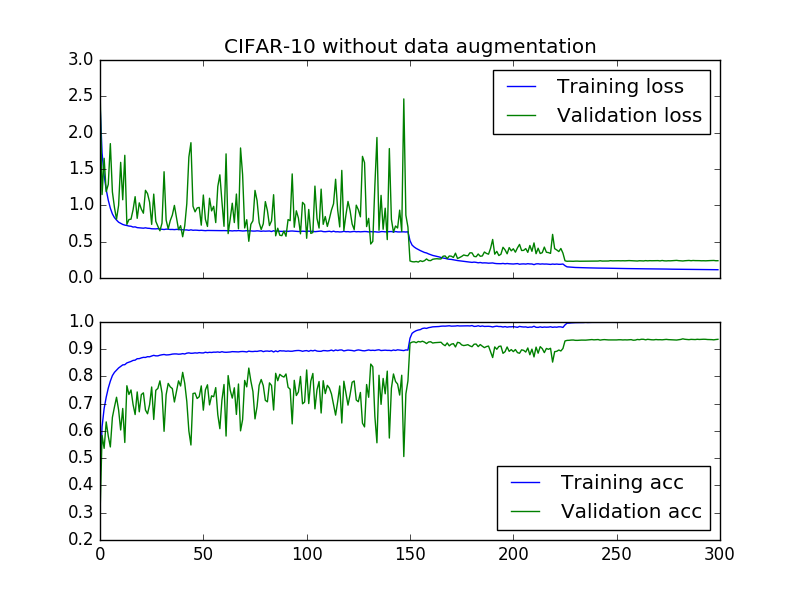
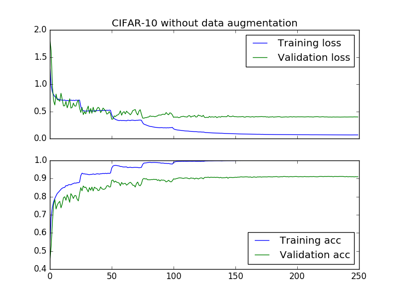
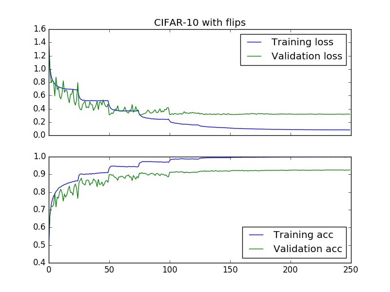

# convet-study: A study of ConvNet architectures on small image datasets

This repository contains implementations of some architectures that I find interesting and get good results on small image datasets (mostly CIFAR-10).

## Requirements

This code runs on [Keras](https://www.github.com/fchollet/keras) and has been tested with [Tensorflow](https://www.tensorflow.org) as backend. You should have a GPU to run this code on a reasonable amount of time.

* Python 2.7.
* Numpy.
* Scipy.
* Pyyaml.
* Tensorflow.
* Keras.
* hdf5, h5py.

## Getting the data

Download the code, run the get_dataset.sh script, it should download the datasets and place them on the appropriate folders.

## Training a model using the train.py script

This script allows training (some) models using a command-line interface. You should pass at least a model loader and a dataset, all the other arguments are optional and have default values. Assuming you are in an ipython session, your call should be something like

`%run train.py -d DATASET -m MODEL_LOADER -b BATCH_SIZE --l2 L2_REGULARIZATION -s SAVE_FILE_NAME --schedule LEARNING_RATE_SCHEDULE --lr LEARNING_RATE -e NUMBER_OF_EPOCHS -v VALID_RATIO`

This script will automatically save the model at every epoch using keras model saving (SAVE_FILE_NAME.h5) along with a metadata file (SAVE_FILE_NAME.meta) that contains the arguments passed, training metrics and learning rate scheduling information. Should you want to resume training run the script with the -l[--load] argument

`%run train.py -l SAVE_FILE_NAME`

This will resume training from the last checkpoint.

## Training a model using your own script

All the models are defined by a function in the [models](rme/models) package. Calling it will return a Keras model that can be trained however you want. You can check the [scripts](./scripts) directory for examples.

## Implemented models

### Densenet

Implementation of [1]. Currently only tested the smaller densenet: 40 layers total, 3 dense blocks with 12 layers with and growth rate of 12. The code should support the bigger models though. Accuracy of **93.58%** without data augmentation (paper reports **93%**) and **94.72%** (paper reports **94.76%**) with horizontal flips and crops.

### Batch-normalized Network in Network

Architecture based on [2], modified to include batch normalization. Achieved **90.97%** accuracy without data augmentation and **92.46%** with flips. Uses learning rate schedule from [3].

### Batch-normalized VGG-like network
Bases on [3], **91.68%** accuracy without data augmentation and **92.92%** with flips.

## References

* [1]: G. Huang, Z. Liu and K. Weinberger. Densely Connected Convolutional Networks. [Arxiv](https://arxiv.org/abs/1608.06993). [Github](https://github.com/liuzhuang13/DenseNet).
* [2]: M. Lin, Q. Chen and S. Yan. Network in Network. [Arxiv](https://arxiv.org/abs/1312.4400).
* [3]: S. Zagoruyko. cifar.torch. [Github](https://github.com/szagoruyko/cifar.torch).
